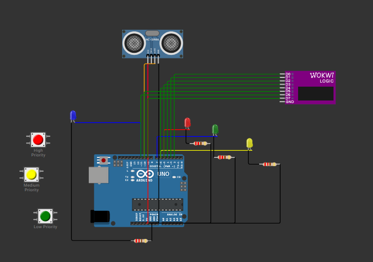

<H1>📖 Lab1: Prekidi u Ugradbenim Sustavima</H1> 

Poveznica za projekt: [Wokwi projekt](https://wokwi.com/projects/427284724839193601)

<H2>1. Opis zadatka</H2>
Cilj ovog laboratorijskog rada je implementacija prekida na mikrokontroleru Arduino Uno korištenjem vanjskih tipki, tajmera i ultrazvučnog senzora. Prekidi su povezani s LED diodama koje služe kao vizualna signalizacija aktivnosti.

Korištene funkcionalnosti:

✅ Vanjski prekidi uz pomoć tipki (INT0, INT1)

✅ Prekid tajmera Timer1 za izvršavanje periodičnih radnji svakih 1 sekundu

✅ Aktivacija LED dioda putem ultrazvučnog senzora (HC-SR04) ako se objekt nalazi na udaljenosti manjoj od 10 cm.

<H2> 2. Hardverske komponente</H2>
Za realizaciju sustava korištene su sljedeće komponente u Wokwi simulatoru:

<table>
<tbody>
<tr>
<td>&nbsp;Komponente </td>
<td>&nbsp;Model&nbsp; </td>
<td>Uloga&nbsp; </td>
</tr>
<tr>
<td>&nbsp;Mikrokontroler </td>
<td>&nbsp;Arduino Uno </td>
<td>&nbsp;Glavni upravljački sklop </td>
</tr>
<tr>
<td>&nbsp;LED diode </td>
<td>&nbsp;4x (različite boje) </td>
<td>&nbsp;Signalizacija prekida </td>
</tr>
<tr>
<td>&nbsp;Tipke (Buttons) </td>
<td>&nbsp;3x Tactile Switch </td>
<td>&nbsp;Aktivacija prekida</td>
</tr>
<tr>
<td>&nbsp;Ultrazvučni senzor </td>
<td>&nbsp;HC-SR04</td>
<td>&nbsp;Mjerenje udaljenosti</td>
</tr>
<tr>
<td>&nbsp;Logički analizator </td>
<td>&nbsp;Wokwi Logic </td>
<td>&nbsp;Analiza signala (simulacija)</td>
</tr>
</tbody>
</table>
<H2> 3. Slika spojeva </H2>
Na sljedećoj slici prikazan je način povezivanja svih komponenti unutar Wokwi simulatora:

<H2> 4. Opis rješenja </H2>
Kod u programu implementira prekide za tipke, tajmer i ultrazvučni senzor koristeći Arduino C++.

<H3> 📌 Vanjski prekidi (tipke)</H3>

Svaka tipka povezana je na digitalni ulaz:
<UL>
<LI>Visoki prioritet: Pin 2 (INT0)</LI>

<LI>Srednji prioritet: Pin 3 (INT1)</LI>

<LI>Niski prioritet: Pin 4 (bez prekida, provjera u loop())</LI>
</UL>
Kada se pritisne odgovarajuća tipka, LED dioda koja odgovara tom prioritetu (crvena za visoki, žuta za srednji, zelena za niski) mijenja svoj status.
Softverski debouncing je implementiran za niski prioritet pomoću delay(200) funkcije.

<H3> 📌 Tajmerski prekid </H3>

Timer1 generira prekid svakih 1 sekundu (vrijednost OCR1A postavljena na 15624, prescaler 1024).

Ovaj prekid omogućuje ispis poruke u serijskom monitoru ("Tajmer: 1 sekunda!").

<H3> 📌 Ultrazvučni senzor (HC-SR04) </H3>

Mjerenje udaljenosti se aktivira u loop() funkciji, ali može biti povezano s tajmerom.
Ako se objekt nalazi bliže od 10 cm, LED dioda na pin 11 (plava) se pali. Inače, LED dioda se gasi.
Udaljenost objekta također se ispisuje u serijski monitor.

<H2> 5. Zaključak </H2>
Ovaj laboratorijski zadatak uspješno demonstrira primjenu prekida na Arduino Uno mikrokontroleru.

🔹 Prekidi omogućuju brz odgovor na pritiske tipki i periodične događaje.

🔹 Softverski debouncing sprječava višestruke aktivacije niskog prioriteta.

🔹 Senzor udaljenosti i tajmer ilustriraju primjenu u stvarnom vremenu.

Moguće buduće nadogradnje:

✅ Dodavanje prekida za senzor udaljenosti umjesto stalne provjere u loop().

✅ Implementacija prioriteta prekida pomoću nested interrupts.

<h3>🛠 Autor:</h3> Dan Hamin

<h3>🎓 Predmet:</h3> Razvoj Ugradbenih Sustava

<h3>🏫 Fakultet:</h3> Tehničko Veleučilište u Zagrebu
