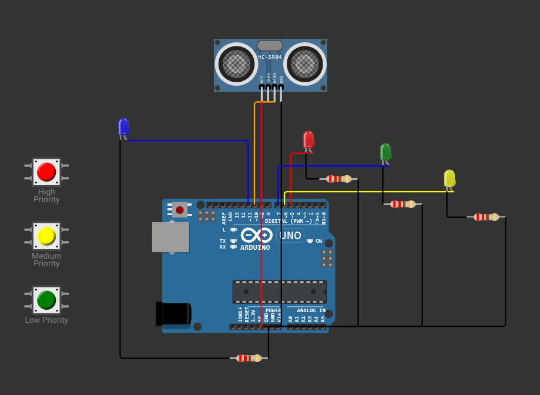

📖 Lab1: Prekidi u Ugradbenim Sustavima

Poveznica za projekt: [Wokwi projekt](https://wokwi.com/projects/427284724839193601)

<2h>1. Opis zadatka</h2>
Cilj ovog laboratorijskog rada je implementacija prekida na Arduino Uno mikrokontroleru koristeći tipke, tajmer i ultrazvučni senzor. Prekidi su povezani s LED diodama za vizualnu signalizaciju aktivnosti.

Korištene funkcionalnosti:

✅ Prekidi pomoću vanjskih tipki (INT0, INT1)

✅ Prekid tajmera Timer1 za periodične radnje svake 1 sekunde

✅ Aktivacija LED-a putem ultrazvučnog senzora (HC-SR04) ako je objekt bliži od 10 cm

2. Hardverske komponente
Za realizaciju sustava korištene su sljedeće komponente u Wokwi simulatoru:

Komponenta	Model	Uloga

Mikrokontroler	Arduino Uno	Glavni upravljački sklop

LED diode	4x (različite boje)	Signalizacija prekida

Tipke (Buttons)	3x Tactile Switch	Aktivacija prekida

Ultrazvučni senzor	HC-SR04	Mjerenje udaljenosti

Logički analizator	Wokwi Logic	Analiza signala (simulacija)

3. Slika spojeva
Sljedeća slika prikazuje način povezivanja komponenti u Wokwi simulatoru:

4. Opis rješenja
Kod implementira prekide za tipke, tajmer i senzor koristeći Arduino C++.

📌 Vanjski prekidi (tipke)

Svaka tipka povezana je na digitalni ulaz:

Visoki prioritet: Pin 2 (INT0)

Srednji prioritet: Pin 3 (INT1)

Niski prioritet: Pin 4 (bez prekida, provjera u loop())

Kada se tipka pritisne, odgovarajuća LED dioda (crvena, žuta, zelena) mijenja stanje.

Debounce je implementiran softverski u loop() za niski prioritet koristeći delay(200).

📌 Tajmerski prekid

Timer1 generira prekid svake 1 sekunde (OCR1A = 15624, prescaler 1024).

Aktivira ispis poruke u serijski monitor ("Tajmer: 1 sekunda!").

📌 Ultrazvučni senzor (HC-SR04)

Mjerenje udaljenosti pokreće se u loop(), ali može se povezati s tajmerom.

Ako je objekt bliže od 10 cm, plavi LED (pin 11) se pali; inače se gasi.

Udaljenost se ispisuje u serijski monitor.

5. Zaključak
Ovaj laboratorijski zadatak uspješno demonstrira korištenje prekida na Arduino Uno mikrokontroleru.

🔹 Prekidi omogućuju brzu reakciju na pritiske tipki i periodične događaje.

🔹 Softverski debounce sprječava višestruke aktivacije za niski prioritet.

🔹 Senzor udaljenosti i tajmer pokazuju primjenu u stvarnom vremenu.

Moguće buduće nadogradnje:

✅ Dodavanje prekida za senzor udaljenosti umjesto provjere u loop().
✅ Implementacija prioriteta prekida putem nested interrupts.
🛠 Autor: [Tvoje ime]

🎓 Predmet: Razvoj Ugradbenih Sustava

🏫 Fakultet: Tehničko Veleučilište Zagreb
