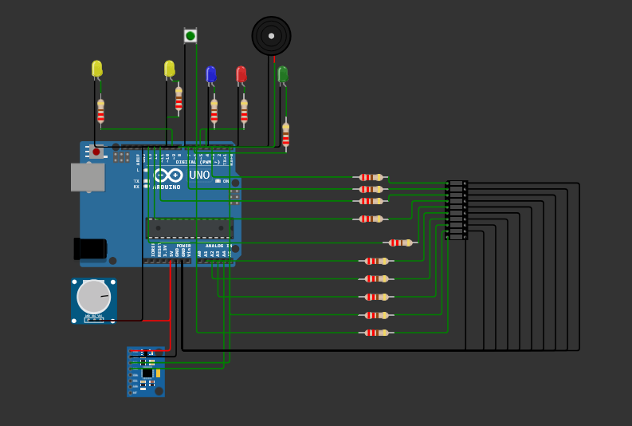

# Automatski pokazivač skretanja bicikla 🚲

## Opis projekta

Ovaj projekt je rezultat timskog rada u sklopu projektnog zadatka kolegija **Razvoj ugradbenih sustava** na **Tehničkom veleučilištu u Zagrebu**.

Cilj projekta je razvoj automatskog pokazivača smjera skretanja za bicikle, s naglaskom na povećanje sigurnosti biciklista u prometu. Sustav automatski prepoznaje smjer skretanja i kočenje koristeći podatke o akceleraciji bicikla, bez potrebe za ručnim signaliziranjem od strane biciklista.

Motivacija za razvoj ovog sustava je smanjivanje rizika od prometnih nezgoda, povećanje vidljivosti biciklista i demonstracija primjene senzora i mikrokontrolera u pametnim prometnim rješenjima.

---

## Funkcijski zahtjevi

- Automatska detekcija skretanja ulijevo/udesno pomoću akceleracije po X-osi.
- Automatska signalizacija kočenja putem detekcije akceleracije po Z-osi.
- Vizualna signalizacija putem žutih LED dioda (lijevo/desno) i LED bar grafikona (stanje baterije).
- Zvučna signalizacija (buzzer) pri ručnom gašenju sustava.
- Sleep mode za uštedu energije u slučaju neaktivnosti.
- Ručno resetiranje sustava putem gumba u slučaju greške ili ekstremne temperature.
- Indikacija greške ili ekstremnih uvjeta putem crvene LED diode.

---

## Tehnologije

- **Arduino Uno** (mikrokontroler)
- **MPU6050** (akcelerometar i žiroskop)
- **LED diode** (žute, crvena, zelena, plava)
- **LED bar grafikon**
- **Buzzer**
- **Push gumb**
- **Potenciometar** (za simulaciju napona u Wokwi simulatoru)
- **Wokwi simulator** (okruženje za razvoj i testiranje)

---

## Instalacija

Projekt se trenutno razvija i testira unutar **Wokwi simulacijskog okruženja**.

Za pokretanje projekta potrebno je:

1. Otvoriti [Wokwi](https://wokwi.com/).
2. Učitati projektni kod i shemu povezivanja.
3. Pokrenuti simulaciju.

---

## Članovi tima

| Ime i prezime | GitHub profil | Doprinos projektu |
|---------------|---------------|--------------------|
| Dan Hamin | [link na GitHub](https://github.com/Dan-Hamin) | Razvoj koda, integracija senzora, dokumentacija |
| Zvonimir Mlinarić | [link na GitHub](https://github.com/zvonimirM328) | Razvoj koda, integracija senzora, dokumentacija |

---

## Kontribucije

Za pravila doprinosa projektu, pogledajte dokument **CONTRIBUTING.md**.

- Jasna podjela zadataka među članovima.
- Dogovorena komunikacija putem dostupnih kanala.
- Rješavanje sporova u skladu s unaprijed definiranim pravilima i kodeksom ponašanja.

---

## 📝 Kodeks ponašanja

Projekt slijedi načela **Contributor Covenant** i **etike IEEE-a**, uključujući:

- Profesionalno i odgovorno ponašanje.
- Poštivanje svih članova zajednice.
- Transparentno donošenje odluka.
- Nulta tolerancija na neprihvatljivo ponašanje.

Više informacija možete pronaći u dokumentu **CODE_OF_CONDUCT.md**.

---

## 📝 Licenca

Ovaj repozitorij je licenciran pod uvjetima **Creative Commons CC BY-NC-SA 4.0**.

- **Dijeljenje** uz navođenje izvora.
- **Ne-komercijalna** upotreba.
- **Dijeljenje pod istim uvjetima**.

Više informacija o licenci dostupno je [ovdje](https://creativecommons.org/licenses/by-nc-sa/4.0/).

---

## Napomena

- Svi korišteni paketi, slike, modeli i animacije imaju svoje vlastite licence.
- Dodatni sadržaji mogu biti licencirani pod **CC0-1.0** (javna domena).

# RUS-Automatski-pokazivac-skretanja-bicikla
[🔗 Poveznica za projekt](https://wokwi.com/projects/429320227133652993)

[finale](https://wokwi.com/projects/429320227133652993)

DIJAGRAMI STANJA I SVIJESTI!!!!!!!!!!!!
